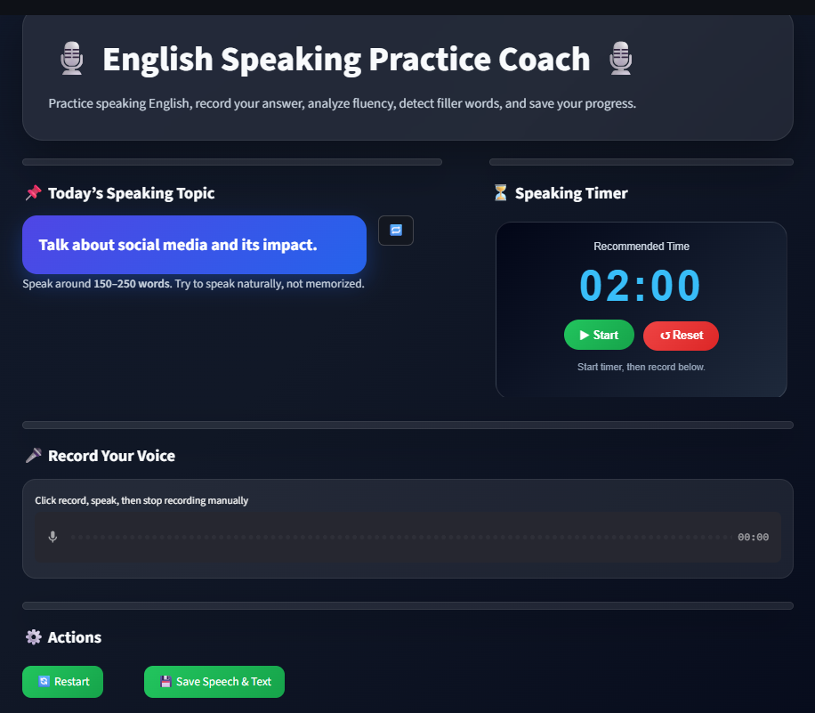

# 🎙️ English Speaking Practice Coach

An interactive Streamlit web app that helps users practice English speaking by recording their voice, converting speech to text, detecting filler words, and tracking speaking performance.

---

## 🚀 Features:
- Random speaking practice topics
- 2-minute speaking timer
- Voice recording
- Speech-to-text conversion
- Filler word detection
- Highlighted transcript
- Word count analysis
- Simple fluency score
- Save speech text and audio history
- Clean dark UI design

---

## 🛠️ Tech Stack:
- Python
- Streamlit
- SpeechRecognition
- Pandas
- HTML/CSS
- JavaScript

---

## 📸 Screenshot:


---

## ▶️ How to Run:
```bash
git clone https://github.com/your-username/english-speaking-practice-coach.git
cd english-speaking-practice-coach
pip install -r requirements.txt
streamlit run app.py

